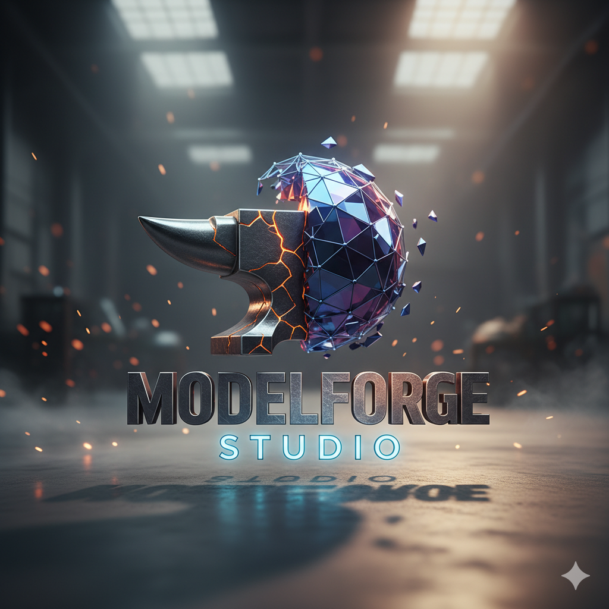

# ModelForge Studio 
## 1. Visão Geral
O **ModelForge Studio** é o ambiente perfeito para modelagem, renderização e simulação 3D voltado para projetos de engenharia, design industrial e desenvolvimento de jogos, tudo dentro do mesmo lugar, proporcionando uma renderização em tempo real, já que ele é baseado em GPU que total compatibilidade com **OpenGL, Vulkan e DirectX 12**

## 2. Estrutura do ModelForge Studio 
| Módulo                | Função Principal                                              | Observações                                       |
| --------------------- | ------------------------------------------------------------- | ------------------------------------------------- |
| **Core Engine**       | Gerencia a renderização, física e memória gráfica.            | Implementado em C++ com suporte a multithreading. |
| **Editor UI**         | Interface de interação do usuário.                            | Desenvolvido com Qt Framework 6.                  |
| **Shader Compiler**   | Responsável por compilar shaders GLSL/HLSL para renderização. | Integração nativa com Vulkan SDK.                 |
| **Simulation Engine** | Processa cálculos de física e colisões.                       | Baseado em biblioteca Bullet Physics.             |

## 3. Etapas de operação

| Etapa | Descrição | Componente Envolvido |
|:--:|:--|:--|
| **1** | Importe um modelo 3D nos formatos `.OBJ`, `.FBX` ou `.STL`. | Interface do Usuário |
| **2** | O modelo é alocado na memória VRAM e convertido em uma malha otimizada. | **Core Engine** |
| **3** | Materiais e efeitos de luz são aplicados em tempo real durante a renderização. | **Shader Compiler** |
| **4** | São processadas colisões e movimentações físicas do modelo. | **Simulation Engine** |
| **5** | O resultado final é renderizado e exportado em `.PNG`, `.TIFF` ou `.MP4`. | **Render Output** |

## 4. requisitos do Sistema
| Componente          | Mínimo                            | Recomendado              |
| ------------------- | --------------------------------- | ------------------------ |
| Processador         | Intel i5 (6ª geração)             | Intel i7 ou Ryzen 7      |
| Memória RAM         | 8 GB                              | 16 GB ou mais            |
| GPU                 | NVIDIA GTX 1060                   | RTX 3060 ou superior     |
| Armazenamento       | 5 GB livres                       | SSD NVMe                 |
| Sistema Operacional | Windows 10 / Linux (Ubuntu 22.04) | Windows 11 / Linux 24.04 |
## 5. Compatibilidade
* Suporte a formatos: .OBJ, .FBX, .STL, .GLTF, .USDZ.

* Exportação de animações em .MP4, .MOV e .AVI.

* Integração com engines externas: **Unity, Unreal Engine 5, Blender**.
## 6. Segurança e Performance

* Prioridade a processos isolados de renderização para redução de travamentos em alto consumo de VRAM.

* Monitoramento interno de temperatura da GPU.

* Salvamento automático a cada 10 minutos.

* Compressão de malhas em tempo real para reduzir latência em cenas complexas.
## 7. Para um melhor desempenho

* Use GPU drivers atualizados para evitar falhas de compilação de shader.

* De preferência para o carregamento  de modelos com até 10 milhões de polígonos em placas inferiores à RTX 2060.

* **Não interrompa o processo de renderização durante o autosave, pois isso pode gerar corrupção de cena.**

## 8. Suporte e Atualizações

* Novas versões  e correções de segurança e novos recursos do ModelForge Studio são atualizadas automaticamente.

* Logs de erro são registrados automaticamente para possíveis diagnósticos em: **/User/AppData/ModelForge/logs**.

* O contato com Suporte técnico para ModelForge Studio  deve ser feito pelo e-mail: **modelforgestudio_support@forgestudio.com** ou pelo canal oficial no GitHub Issues: **github.com/modelforgestudio/issues**

### 🔧 Notas Técnicas

Linguagem-base: C++ / Python API para extensões.

Framework gráfico: Vulkan SDK 1.3.

Sistema de compilação: CMake.

Licença: ModelForge Pro Edition (uso comercial).

### ⚠️ Aviso Importante

**Nunca interrompa o software durante processos de renderização, perdas parciais de texturas e dados de simulação podem ocorrer.**

Mantenha sempre o **backup automático ativado** no menu de preferências.
